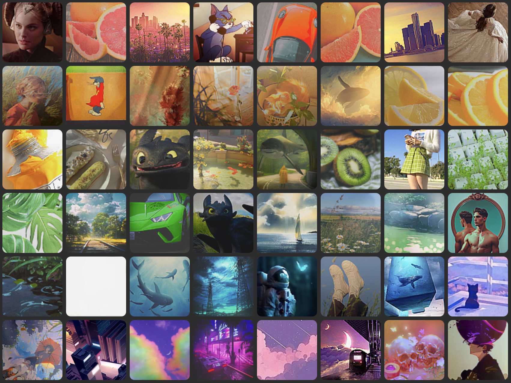

# Sort by Color

A web app that automatically arranges images by hue. Upload local files or add images by URL; the gallery stays sorted by color at all times.



---

## How it works

Each image is analyzed server-side using Pillow and NumPy:

1. The image is resized to 64×64 and converted to RGB
2. Near-black and near-white pixels are masked out (brightness < 20 or > 235), leaving only the chromatic pixels
3. The remaining pixels are averaged into a single representative RGB color
4. That color's **hue angle** (0–360°) is computed from the HSV formula and stored in a cache
5. The gallery is sorted ascending by hue — reds → oranges → yellows → greens → blues → purples

The hue cache (`uploads/angle_cache.json`) means images are only analyzed once, even across server restarts.

---

## Features

- **Upload files** — JPEG, PNG, WEBP, GIF supported
- **Add from URL** — fetches and analyzes hosted images without downloading them permanently
- **Delete images** — removes the file or URL and updates the gallery in place
- **Copy HTML** — copies `` tags for all URL-sourced images, sorted by hue, ready to paste
- **Live-sorted gallery** — new images slot into the correct hue position immediately, no reload needed
- **Persistent cache** — hue values are cached so the server starts fast even with many images

---

## Stack

| Layer | Technology |
|---|---|
| Backend | Python · FastAPI · Pillow · NumPy |
| Frontend | React (Vite) |
| Serving | Uvicorn |

---

## Setup

**Prerequisites:** Python 3.10+, Node 18+

### 1. Backend

```bash
python -m venv env
source env/bin/activate       # Windows: env\Scripts\activate
pip install -r requirements.txt
uvicorn main:app --reload
```

The API will be available at `http://localhost:8000`.

### 2. Frontend

```bash
cd frontend
npm install
npm run dev
```

The app will be available at `http://localhost:5173`.

---

## API reference

| Method | Endpoint | Description |
|---|---|---|
| `GET` | `/uploads-list` | Returns all images sorted by hue angle |
| `POST` | `/upload-image` | Upload a local image file |
| `POST` | `/save-url` | Add a hosted image by URL |
| `POST` | `/delete-image` | Remove an image (file or URL) |
| `GET` | `/uploads/{filename}` | Serve an uploaded file |

---

## Project structure

```
sortbycolor/
├── main.py              # FastAPI app — upload, delete, hue analysis
├── requirements.txt
├── uploads/             # Uploaded files + cache
│   ├── angle_cache.json # Cached hue angles (auto-generated)
│   └── hosted_urls.txt  # Persisted URL list (auto-generated)
└── frontend/
    └── src/
        ├── App.jsx      # Main React component
        └── App.css      # Styles
```
